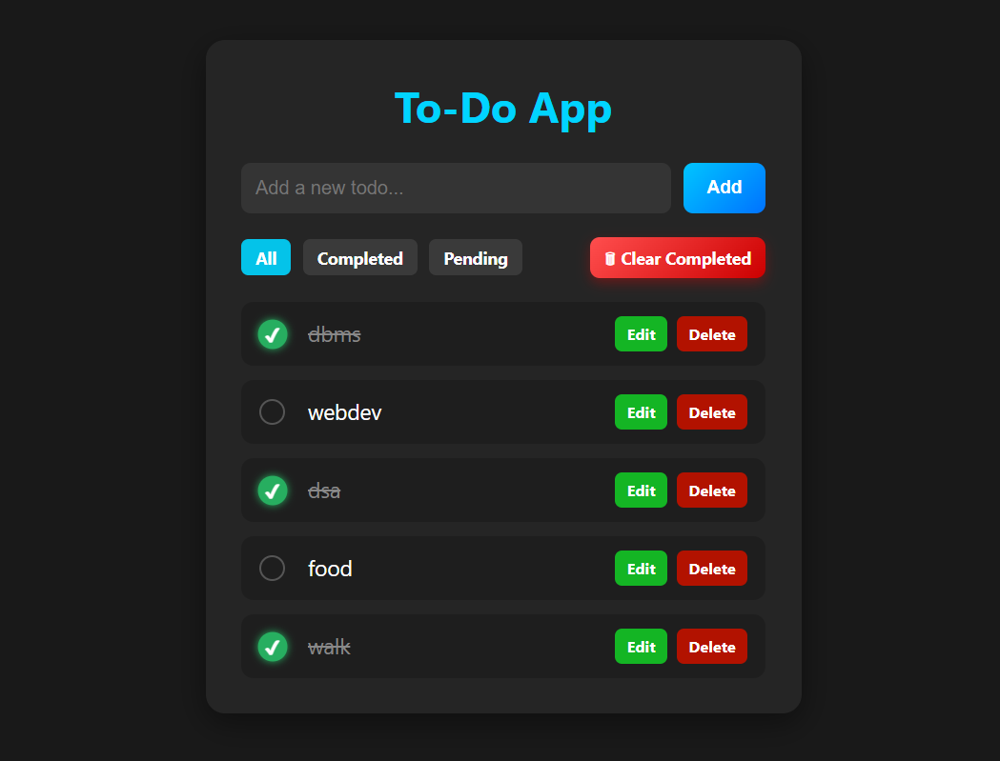

# 📝 To-Do App (Backend)

A simple To-Do application backend built with **Node.js, Express, and MongoDB**.  
This project allows you to add, delete, mark as completed, and filter tasks.

---

## 🚀 Features
- ➕ Add new tasks  
- 🗑️ Delete tasks  
- ✅ Mark tasks as completed or pending  
- 🔍 Filter tasks (All, Completed, Pending)  
- 💾 Store tasks in MongoDB  
- 📄 EJS views for rendering (basic frontend)

---

## 🛠️ Tech Stack


 


---

## 📸 Preview  


---

## 📂 Installation & Setup

### 1️⃣ Clone the repo
```bash
git clone https://github.com/shahidx05/Todo-Backend.git
```

### 2️⃣ Go inside the folder
cd Todo-Backend

### 3️⃣ Install dependencies
npm install

### 4️⃣ Setup environment variables

### Create a .env file and add:
MONGODB_URI=your_mongodb_connection_string
PORT=3000

### 5️⃣ Run the server
npm start

